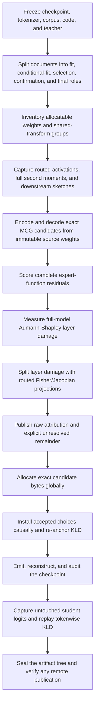

# ShapleyMCG

ShapleyMCG is an auditable method for deciding **which real low-bit
reconstruction each weight should receive** under a fixed byte budget. It was
developed for routed mixture-of-experts (MoE) models, but its scoring and
allocation boundaries also apply to dense models.

The practical idea is:

1. freeze the teacher, data, codec, and comparison rules;
2. encode real low-bit candidates from immutable source weights;
3. estimate how each candidate's error reaches the model output;
4. spend the exact byte budget where it avoids the most end-to-end damage; and
5. accept the result only if untouched teacher-to-student KLD agrees.

This README explains that pipeline from input checkpoint to sealed result. The
numbers are kept separately in **[RESULTS.md](RESULTS.md)**. Exact hashes,
revisions, and remote receipts are in the
[Qwen evidence ledger](docs/QWEN_COMPLETE_RESULTS_LEDGER.md).

## Read this status boundary first

The repository contains three different kinds of material. They must not be
confused:

| Label | Meaning |
| --- | --- |
| **Validated** | Executed on Qwen, measured with stored logits, and independently replayed where the result ledger says so |
| **Implemented, unvalidated** | Code and deterministic tests exist, but no sealed real-model endpoint supports a quality claim |
| **Design contract** | The required behavior for a future campaign or runtime; it is not evidence that the stage ran |

The validated scientific result is the **single-candidate-pool, exact-rate
ShapleyMCG allocation path**: actual MCG or published EXL3 candidates are held
fixed, Aumann–Shapley/Fisher information changes their allocation, and the
result is adjudicated with end-to-end KLD.

The repository also contains model-neutral, fail-closed primitives for choosing
**candidate factory and K3/K4 rate jointly**. They are experimental library
infrastructure, not a qualified Qwen command or endpoint. They have not
produced any result in this repository and are not part of the validated
claims. The completed factory experiments instead froze the per-matrix rates
and changed reconstruction source at whole-layer granularity.

Likewise, a reconstructed BF16 quality result does not qualify a packed
checkpoint for a serving engine. Native reader support, CUDA-graph parity,
KV-cache format, throughput, and stability are separate runtime gates.

## What is optimized

The primary outcome is next-token
`KL(BF16 teacher || quantized student)` on tokens excluded from fitting and
selection. Lower is better.

Four rules follow:

- **Real codec outputs are the candidates.** Fake-quant error may screen ideas,
  but it cannot replace the reconstruction and payload produced by the encoder.
- **Proxy scores propose; final KLD decides.** Hessian loss, routed residuals,
  Fisher/Jacobian projections, and Aumann–Shapley attribution make the search
  affordable. None is relabeled as measured model KLD.
- **Bytes, not bit names, constrain allocation.** A nominal K3 or K4 label is
  not enough when transforms, vectors, padding, or shared payloads differ.
- **A comparison changes one factor at a time.** Parent revision, tokens,
  teacher logits, backend, arithmetic, non-expert body, candidate bytes, and
  rate remain fixed whenever the stated claim requires them to be.

## Pipeline map



Candidate factories are an additive branch around stages E and J: multiple
factories may propose reconstructions, but only a common-score, compatible,
exact-byte allocation may mix them. The validated experiments and the
unvalidated joint composition are distinguished in stages 6 and 9 below.

## 1. Freeze every identity before calibration

### Why

Changing a model shard, tokenizer, corpus row, codec build, or teacher logits
mid-run invalidates every downstream comparison.

### Inputs

- immutable model and dataset revisions;
- model config, index, and source shards;
- tokenizer files;
- codec source, numeric core, and extension;
- experiment configuration and output policy.

### Process and output

The experiment specification resolves local inputs, checks revisions, and
records content hashes. Every later receipt binds those identities.

Use:

- [`src/quant_pipeline/spec.py`](src/quant_pipeline/spec.py) for the experiment
  contract;
- [`examples/qwen3-30b-a3b.toml`](examples/qwen3-30b-a3b.toml) as the Qwen
  starting specification; and
- [`quant-pipeline inspect`](src/quant_pipeline/cli.py) to validate a spec.

## 2. Split the corpus by whole document

Window-level shuffling can leak nearby text between fitting and evaluation.
The current pipeline assigns **whole documents** to five roles:

| Role | May influence | Must not influence |
| --- | --- | --- |
| `fit` | Hessians, covariance, scales, transforms, and sketches | candidate acceptance or reported final KLD |
| `conditional_fit` | decoded gate/up state used to fit conditional down projections | selection, confirmation, or reported final KLD |
| `selection` | candidate ranking, calibration maps, and allocation | reported final KLD |
| `confirmation` | prospective sign/rank/regret, closure, and optional-tail gates | reported final KLD |
| `final` | untouched end-to-end quality | any fitted or selected choice |

The current scientific gate requires at least 25 final windows across four
domains for a new headline result. Historical Qwen evidence used the earlier
four-role corpus contract; it remains a valid controlled comparison but is not
retroactively described as having used the new `conditional_fit` split.

Use:

- [`src/quant_pipeline/calibration/windows.py`](src/quant_pipeline/calibration/windows.py)
  for role assignment;
- [`scripts/prepare_reap_recall_corpus.py`](scripts/prepare_reap_recall_corpus.py)
  to verify and role-pack the published calibration JSONL; and
- [`src/quant_pipeline/evaluation/kld_window.py`](src/quant_pipeline/evaluation/kld_window.py)
  to seal a target-tokenized WikiText instrument.

## 3. Inventory weights and compatibility groups

An allocatable unit is a weight tensor or tensor slice with its own candidate
choice. In Qwen3 MoE the leaf units are expert `gate_proj`, `up_proj`, and
`down_proj` matrices. The inventory records layer, expert, projection, source
tensor, legal rates, and the shared-transform group that constrains which
choices may coexist.

This prevents two common accounting errors: treating “3.5 BPW” as though it
specifies the per-matrix allocation, and charging a shared transform once per
matrix instead of once per group.

Use [`src/quant_pipeline/models/inventory.py`](src/quant_pipeline/models/inventory.py)
and the `quant-pipeline inventory` command.

## 4. Capture the model state actually visited

For every routed observation, capture records the layer, expert, route weight,
projection input, document identity, token offset, and predecessor-state
identity. The fitter accumulates the full uncentered second moment

```text
H_p = sum(route_weight ** p * x x^T) / sum(route_weight ** p)
```

for route powers `p = 0, 1, 2` in float64. Cross-coordinate terms are retained;
the competitive path does not replace the matrix with a diagonal statistic.
Natural routed observations and supplemental low-traffic-expert observations
remain separately auditable.

Down-projection fitting is conditional: decoded gate and up projections create
the actual post-SiLU input that a candidate down projection will see. The fit
role produces this state; confirmation rows are reserved for prospective
checks and do not fit candidates.

Use:

- [`src/quant_pipeline/calibration/qwen_capture.py`](src/quant_pipeline/calibration/qwen_capture.py);
- [`src/quant_pipeline/calibration/fitter.py`](src/quant_pipeline/calibration/fitter.py);
- [`scripts/run_qwen_calibration_capture.py`](scripts/run_qwen_calibration_capture.py); and
- [`scripts/run_qwen_streaming_fit.py`](scripts/run_qwen_streaming_fit.py).

Outputs are sealed routed captures, full-moment fit artifacts, conditional-down
artifacts, route-mass audits, and downstream sketch inputs.

## 5. Generate exact MCG candidates

Every candidate starts from the immutable BF16 source tensor. The corrected
EXL3/MCG path:

1. applies a deterministic incoherence transform;
2. derives absolute-v31 normalization from the source and fitted statistics;
3. searches a matrix- and bit-specific GSS scalar;
4. invokes the pinned encoder;
5. decodes the candidate; and
6. hashes the packed payload, private/shared vectors, and reconstructed tensor.

The proposal search currently includes identity, diagonal-order, and
energy-balanced permutations plus identity, per-128-grid, and inverse-grid
scale families. Gate and up share the input-side transform; down shares the
residual output-side transform. A mixture is legal only when its shared-domain
hashes agree.

For the competitive Qwen K3/K4 arm, all eight gate/up/down bit triplets must be
represented. K5 is allowed only behind a separately sealed selection and
confirmation gate. General mechanics support for another bit width is not
evidence that it is a competitive MCG candidate.

Use:

- [`src/quant_pipeline/normalization`](src/quant_pipeline/normalization) for
  absolute-v31, transforms, and GSS receipts;
- [`src/quant_pipeline/codecs/exl3_mcg.py`](src/quant_pipeline/codecs/exl3_mcg.py)
  for the pinned codec boundary;
- [`src/quant_pipeline/candidates/ledger.py`](src/quant_pipeline/candidates/ledger.py)
  for exact candidates and cost records;
- [`scripts/run_qwen_fast_encode.py`](scripts/run_qwen_fast_encode.py) for a
  layer; and
- [`scripts/run_qwen_encode_waves.sh`](scripts/run_qwen_encode_waves.sh) for
  resumable parallel layer waves.

## 6. Score complete expert functions

Matrix reconstruction error is not the routed function being preserved. The
held-out scorer therefore evaluates

```text
down(SiLU(gate(x)) * up(x))
```

using decoded gate, up, and down candidates. This exposes interaction terms
that three independent matrix losses miss. Raw codec loss, routed output loss,
route drift, and downstream damage remain separate ledger fields.

The score is still a proposal signal. It is not final model KLD.

## 7. Attribute end-to-end damage

### Layer-level Aumann–Shapley path

Choose a real provisional codec endpoint, such as uniform K4. For every MoE
layer, blend the source and decoded expert-block outputs:

```text
source_output + alpha[layer] * (decoded_output - source_output)
```

All layer coefficients travel together from the source model to the decoded
endpoint. At canonical Gauss–Legendre nodes, the pipeline differentiates
teacher-to-path KLD with respect to every layer coefficient. Weighted
quadrature integrates those gradients into signed layer contributions.

This stage requires complete model forward/backward passes. It is not inferred
from local Hessian loss.

### Expert-level Fisher/Jacobian split

Inside a layer, running a separate full-model path for every expert would be
prohibitive. Instead, actual routed expert residuals are projected through a
sealed downstream score-function Fisher/Jacobian sketch. If `z_e` is the
projected residual for expert `e`, the quadratic share is

```text
psi_e = 0.5 * mean(z_e * sum_j(z_j))
```

This splits pairwise cross-expert terms symmetrically and closes to the
quadratic surrogate.

Use:

- [`src/quant_pipeline/scoring/attribution.py`](src/quant_pipeline/scoring/attribution.py);
- [`src/quant_pipeline/scoring/qwen_experts.py`](src/quant_pipeline/scoring/qwen_experts.py);
- [`src/quant_pipeline/campaign/qwen_attribution.py`](src/quant_pipeline/campaign/qwen_attribution.py);
- [`scripts/run_qwen_mcg_native_attribution.py`](scripts/run_qwen_mcg_native_attribution.py); and
- [`scripts/reconcile_qwen_mcg_attribution.py`](scripts/reconcile_qwen_mcg_attribution.py).

## 8. Reconcile honestly

Finite quadrature and a low-rank downstream sketch need not equal the measured
codec endpoint. A valid ledger publishes:

1. raw layer and expert attribution;
2. direct expert-codec damage;
3. routing/state-shift damage;
4. the measured provisional endpoint;
5. the signed nonlinear/backend remainder; and
6. a separate accounting reconciliation.

The reconciliation may make expert entries sum to a layer account and layer
accounts plus explicit remainder sum to the measured endpoint. It must not
overwrite the raw values or claim that the unadjusted proxy was perfectly
additive.

## 9. Allocate rate—and, when qualified, candidate factory

### Validated exact-rate allocation

For each expert, the reconciled causal share anchors the actual candidate
damage curve. The validated Qwen K3/K4 path maps real K3-versus-K4 proxy deltas
onto that causal scale and solves one global multiple-choice knapsack under the
exact payload-byte budget. It does not impose an equal budget per layer.

Use:

- [`src/quant_pipeline/allocation/global_dp.py`](src/quant_pipeline/allocation/global_dp.py);
- [`scripts/allocate_qwen_mcg_causal_exact_3p5.py`](scripts/allocate_qwen_mcg_causal_exact_3p5.py); and
- [`docs/SHAPLEYMCG_METHOD.md`](docs/SHAPLEYMCG_METHOD.md) for the normative
  label attached to the measured allocation.

### Candidate factories

A factory is a source of exact reconstructed candidates: native source-state
MCG, progressive-state MCG, a compatible published EXL3 reconstruction, or a
future proposal family. The native factory must cover every legal unit/rate;
optional factories add alternatives rather than becoming hidden dependencies.

Completed factory tests kept the full causal per-matrix rates frozen and
selected whole-layer reconstruction sources on selection-only rows. Those are
**factory diagnostics**, not joint factory/rate results.

### Joint factory/rate composition: experimental infrastructure

The model-neutral primitives validate factory identities, source-fixed common
scores, exact bytes, and shared-domain compatibility before a coupled
allocation may choose `(factory, rate)` choices. They fail closed when factory
coverage, scoring identity, or exact budget closure is incomplete.

Relevant surfaces:

- [`src/quant_pipeline/candidates/factory_union.py`](src/quant_pipeline/candidates/factory_union.py);
- [`src/quant_pipeline/candidates/factory_calibration.py`](src/quant_pipeline/candidates/factory_calibration.py);
- [`src/quant_pipeline/candidates/factory_allocation.py`](src/quant_pipeline/candidates/factory_allocation.py).

There is deliberately no advertised Qwen joint-allocation CLI: the native and
progressive reconstructions must first be rescored under one genuinely shared,
source-fixed instrument. **No sealed joint real-Qwen endpoint has been
produced.** A future qualification must add that common-score adapter,
materialize the chosen model, measure untouched final KLD, independently replay
it, and bind the endpoint to the exact calibration and allocation receipts.

## 10. Re-anchor causally

Later layers see the output of earlier quantized layers, not BF16 activations.
The causal runner installs accepted layers in order and remeasures exact KLD at
the configured interval, at least every four accepted layers in the current
method contract. A failed gate must produce an explicit continue, rollback, or
reallocation decision.

Progressive calibration may capture later-layer states from an accepted
predecessor reconstruction, but encoding still reads immutable BF16 source
weights. This changes the fitted state, not the object being quantized.

Use [`src/quant_pipeline/campaign/runner.py`](src/quant_pipeline/campaign/runner.py)
and the Qwen adapter surfaces under
[`src/quant_pipeline/campaign`](src/quant_pipeline/campaign).

The generic journaled campaign remains an integration surface rather than the
source of the published Qwen endpoints. Review its plan and audit artifacts
before execution; do not infer scientific validation from a successful unit
test or dry run.

## 11. Reconstruct and audit the checkpoint

The selected payload handoff verifies source, packed-payload, and
reconstruction hashes, then reconciles private and shared bytes. The expanded
BF16 reconstruction is useful for controlled quality measurement. A compact
carrier additionally needs a compatible reader and runtime-specific audit.

Use:

- [`src/quant_pipeline/checkpoint/exact_payload.py`](src/quant_pipeline/checkpoint/exact_payload.py);
- [`src/quant_pipeline/checkpoint/btx_qwen.py`](src/quant_pipeline/checkpoint/btx_qwen.py);
- [`src/quant_pipeline/checkpoint/official_btx.py`](src/quant_pipeline/checkpoint/official_btx.py); and
- [`scripts/assemble_qwen_validation_model.py`](scripts/assemble_qwen_validation_model.py).

BTX atom assembly and CPU reconstruction do not prove that a fused target
kernel supports every selected combination.

## 12. Let untouched KLD decide

Final evaluation fixes the parent, tokens, teacher, backend, arithmetic,
non-expert body, and candidate scope required by the comparison. It stores
teacher logits, student logits, and every tokenwise KL value.

The report includes means, tails, per-window values, top-1 agreement, paired
comparisons, and uncertainty where the sampling unit permits it. A separate
float64 implementation replays the logits and checks hashes, shapes,
aggregation, and comparison direction.

Use:

- [`scripts/measure_qwen_mcg_causal_allocation.py`](scripts/measure_qwen_mcg_causal_allocation.py);
- [`scripts/verify_qwen_mcg_causal_kld.py`](scripts/verify_qwen_mcg_causal_kld.py); and
- [`docs/SCIENTIFIC_METHOD.md`](docs/SCIENTIFIC_METHOD.md) for acceptance gates.

## 13. Seal and publish provenance

Every stage writes canonical receipts binding inputs, outputs, code, predecessor
state, and attempt number. A publication tree includes, at minimum:

- Git, model, dataset, tokenizer, and environment identities;
- corpus-role and KLD-window seals;
- calibration statistics and route audits;
- transform, GSS, candidate, and exact-byte records;
- raw and reconciled attribution plus explicit remainder;
- allocation and installed-cost closure;
- checkpoint manifest and reader audit;
- teacher/student logits and tokenwise KLD;
- independent replay; and
- a tree manifest plus remote verification receipt.

Use:

- [`scripts/seal_artifact_tree.py`](scripts/seal_artifact_tree.py);
- [`scripts/upload_sealed_artifact_tree_hf.py`](scripts/upload_sealed_artifact_tree_hf.py); and
- [`scripts/verify_hf_artifact_tree.py`](scripts/verify_hf_artifact_tree.py).

Publication is an explicit side effect. Planning, scoring, or allocation must
not upload data automatically. The uploader is expected to publish only files
covered by the sealed manifest, and the verifier rejects missing, changed, or
unexpected remote files.

## Reproducing the validated Qwen path

### Install and test

```bash
git clone https://github.com/brandonmmusic-max/shapleymcg.git
cd shapleymcg
python3 -m venv .venv
. .venv/bin/activate
python -m pip install -e '.[hf,test]'
pytest -q
```

Tests validate schemas, accounting, deterministic allocation, resumability,
reconstruction, and tamper failure. They do not establish model quality.

### Stage order

The measured Qwen path is intentionally exposed as inspectable scripts rather
than one opaque command:

1. prepare roles with
   [`prepare_reap_recall_corpus.py`](scripts/prepare_reap_recall_corpus.py);
2. seal the instrument and teacher with `quant-pipeline seal-kld-window` and
   `quant-pipeline capture`;
3. capture routed `fit`, `conditional_fit`, and `selection` state—never the
   prospective `confirmation` or untouched `final` roles—with
   [`run_qwen_calibration_capture.py`](scripts/run_qwen_calibration_capture.py);
4. fit layers with
   [`run_qwen_streaming_fit.py`](scripts/run_qwen_streaming_fit.py);
5. encode exact candidates with
   [`run_qwen_fast_encode.py`](scripts/run_qwen_fast_encode.py) or
   [`run_qwen_encode_waves.sh`](scripts/run_qwen_encode_waves.sh);
6. build the immutable inventory with
   [`build_qwen_candidate_inventory.py`](scripts/build_qwen_candidate_inventory.py);
7. measure attribution with
   [`run_qwen_mcg_native_attribution.py`](scripts/run_qwen_mcg_native_attribution.py);
8. reconcile and allocate with
   [`reconcile_qwen_mcg_attribution.py`](scripts/reconcile_qwen_mcg_attribution.py)
   and
   [`allocate_qwen_mcg_causal_exact_3p5.py`](scripts/allocate_qwen_mcg_causal_exact_3p5.py);
9. evaluate and replay with
   [`measure_qwen_mcg_causal_allocation.py`](scripts/measure_qwen_mcg_causal_allocation.py)
   and [`verify_qwen_mcg_causal_kld.py`](scripts/verify_qwen_mcg_causal_kld.py);
10. bind the original GLM calibration bytes and GLM-style KLD procedure to the
    Qwen corpus, target-tokenized window, BF16 teacher, and measured fast gate
    with [`bind_qwen_glm_lineage.py`](scripts/bind_qwen_glm_lineage.py); and
11. seal, upload only after approval, and verify the immutable revision.

The lineage receipt deliberately makes two different claims. The original
`reap_recall_calib.jsonl` is verified byte-for-byte against its immutable GLM
model revision. The KLD control reproduces the pinned WikiText-2 raw-test
source-prefix procedure, but Qwen token IDs and BF16 logits are regenerated
with the pinned Qwen tokenizer and model. It never claims that GLM token IDs or
GLM logits can be reused across model families. The published
[`lineage.json`](https://huggingface.co/datasets/brandonmusic/shapleymcg-qwen3-30b-a3b-reproducibility/blob/a77141740749a53ede41d96115ba911f5b569f76/results/qwen3-30b-a3b-base/progressive-candidate-v1/glm-lineage/lineage.json)
has downloaded SHA-256
`4e9ac680d13750ec2c5e1e1744701b788663db6d03323df0f2d59397b0909066`
and internal lineage seal
`eadb5a8f579e7f40cd25ead031348c526cb6b6da0870e5a19fcb5eaf0831bee5`.
The complete preserved evidence and hashes are audited in
[`docs/QWEN_BASE_REPRODUCIBILITY_AUDIT.md`](docs/QWEN_BASE_REPRODUCIBILITY_AUDIT.md).

Each model-loading or mutating script supports an explicit execution boundary;
inspect `--help` and the matching published command receipt before substituting
paths. The [B200 runbook](docs/B200_RUNBOOK.md) documents clean-node
preparation and intentionally stops at an owner-approval barrier.

The progressive/factory scripts
[`run_qwen_progressive_candidate_experiment.sh`](scripts/run_qwen_progressive_candidate_experiment.sh)
and
[`run_qwen_progressive_candidate_validation.sh`](scripts/run_qwen_progressive_candidate_validation.sh)
reproduce the **frozen-rate diagnostic**, not the unvalidated joint allocator.

## Claim language

- **Allocator improvement:** identical candidate reconstructions, rate, parent,
  body, teacher, tokens, backend, and evaluator; only the allocation changes.
- **Candidate-factory improvement:** identical per-matrix rates and allocator;
  only reconstruction source changes.
- **Progressive-state improvement:** identical source weights, codec, policy,
  corpus, and evaluator; only calibration-producing predecessor state changes.
- **Codec improvement:** identical allocation and every non-codec factor.
- **Joint factory/rate improvement:** a calibrated coupled allocation plus an
  untouched, independently replayed endpoint bound to its exact artifacts.
- **Pipeline improvement:** complete systems compared at matched realized scope
  and bytes, explicitly labeled as a pipeline comparison.
- **Runtime qualification:** native reader/kernel support, eager/graph logit
  parity, and repeatable serving measurements.

See [RESULTS.md](RESULTS.md) for what the present evidence actually supports.

## Repository map

| Path | Purpose |
| --- | --- |
| [`src/quant_pipeline`](src/quant_pipeline) | calibration, candidate, scoring, allocation, campaign, evaluation, and checkpoint library |
| [`scripts`](scripts) | concrete Qwen stages, sealers, uploaders, and independent verifiers |
| [`configs`](configs) | fail-closed campaign templates and artifact locks |
| [`examples`](examples) | hardware-neutral experiment specifications |
| [`tests`](tests) | unit, integration, accounting, and tamper tests |
| [`docs`](docs) | method contracts, runbooks, audits, references, and detailed evidence |
| [`results`](results) | compact checked-in result ledgers; large artifacts live on Hugging Face |

## Attribution and license

ShapleyMCG is Brandon M. Music's integration, implementation, experiment, and
publication work built on important prior research and software:

- Robert Aumann and Lloyd Shapley for the Aumann–Shapley value;
- Joshua Hill and NVIDIA Model Optimizer PR #2183 for the direct modern
  quantization/additivity precedent;
- Albert Tseng and the QTIP/QuIP# authors for trellis quantization and
  incoherence processing;
- turboderp and ExLlamaV3 contributors for EXL3/TRELLIS, MCG, tooling, and the
  runtime ecosystem;
- the Qwen team for Qwen3;
- [Z.ai](https://z.ai/) for
  [GLM-5.2](https://huggingface.co/zai-org/GLM-5.2), the source model for the
  preserved prior-control lineage;
- [malaiwah](https://huggingface.co/malaiwah) and
  [Josh Cartu](https://github.com/jcartu) for the MTP-78 overlay, calibration
  capture, recipe, and rank-sliced work associated with that named prior GLM
  checkpoint;
- Luke Alonso and Local Inference Lab contributors for B12X and related local
  runtime work; and
- the mixed-precision, post-quantization, router-aware, and route-shift work
  mapped in [`docs/REFERENCES.md`](docs/REFERENCES.md).

This repository is source-available under its attribution-required
[`LICENSE`](LICENSE), not an OSI open-source license. Derived B12X code remains
under Apache-2.0 where marked. See
[`THIRD_PARTY_NOTICES.md`](THIRD_PARTY_NOTICES.md),
[`THIRD_PARTY_LICENSES`](THIRD_PARTY_LICENSES), and
[`CITATION.cff`](CITATION.cff) before reuse or publication.
